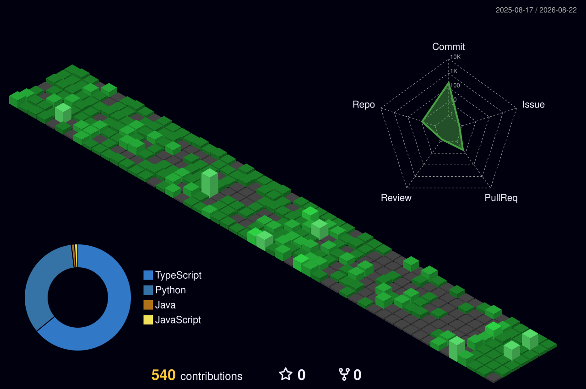

<!-- --- -->

  

 

<!-- --- -->

  

<h3 align="left">Connect with me:</h3>

<!-- --- -->

  

### 💫 About Me:
- 🔭 I’m currently working on **Drop Of Hope (Blood Donation Management System)**
- 🌱 I’m currently learning **Next Js, React Native, Supabase**
- 💬 Ask me about **React, Tailwind CSS, JavaScript, Java, Python**
- 📫 How to reach me: **kharajaynam@gmail.com**

<!-- --- -->

  

### 💻 Tech Stack:
<!-- 01. Languages -->
<h3>01. Languages</h3>

  

<!-- 02. Frameworks/Libraries -->
<h3>02. Frameworks/Libraries</h3>

  

<!-- 03. ML/Data -->
<h3>03. ML/Data</h3>

  

<!-- 04. Cloud/DevOps & Tools -->
<h3>04. Cloud/DevOps & Tools</h3>

  

<!-- --- -->

  

### 📊 GitHub Stats:

  
  

  

<!-- --- -->

  

### ✍️ Random Dev Quote

  

<!-- --- -->

  

