 

<!-- Contributions Section -->
<h3><code>jainam@github ~ $ ./contributions.sh</code></h3>

   

<!-- Whoami Section -->
<h3><code>jainam@github ~ $ whoami</code></h3>

  <table border="0" cellpadding="0" cellspacing="0">
    <tr>
      <td valign="top" align="center" style="padding-right: 12px;"></td>
      <td valign="top" align="center" style="padding-left: 12px;"></td>
    </tr>
  </table>

  

  

 

<!-- About & Contact Section -->

  <table width="100%">
    <tr>
      <td width="60%" valign="top">
        <h3>💫 About Me</h3>
        <ul>
          <li>🔭 Currently building <b>Drop Of Hope</b> (Blood Donation Management System)</li>
          <li>🌱 Masterlining <b>Next.js, React Native & Supabase</b></li>
          <li>💬 Ask me about <b>React, Tailwind CSS, JavaScript, Java, Python</b></li>
          <li>📫 Email: <a href="mailto:kharajaynam@gmail.com"><b>kharajaynam@gmail.com</b></a></li>
        </ul>
      </td>
      <td width="40%" valign="top" align="center">
        <h3>🌐 Connect With Me</h3>
         
        
        &nbsp;&nbsp;
        
      </td>
    </tr>
  </table>

 

  

 

<!-- Tech Stack Section -->

  <h3>💻 Tech Stack</h3>
  
  
<b>Languages</b>

  
  
    
  
  
<b>Frameworks &amp; Libraries</b>

  
  
    
  
  
<b>ML &amp; Data</b>

  
  
    
  
  
<b>Cloud, DevOps &amp; Infrastructure</b>

  

  

  

<!-- Analytics & Highlights Section -->

  <h3>📊 GitHub Analytics</h3>
   
  
  &nbsp;&nbsp;
  
  
   

  

  

 

<!-- Quote Section -->

  <h3>✍️ Dev Quote</h3>
  

 

<!-- --- -->

  

